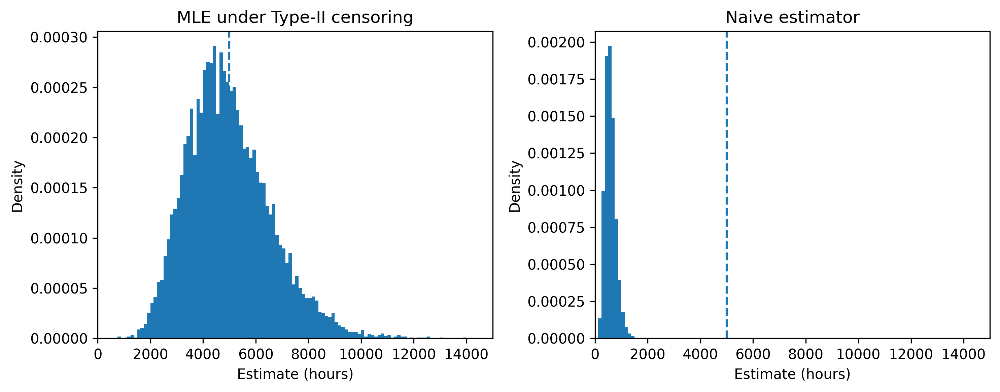
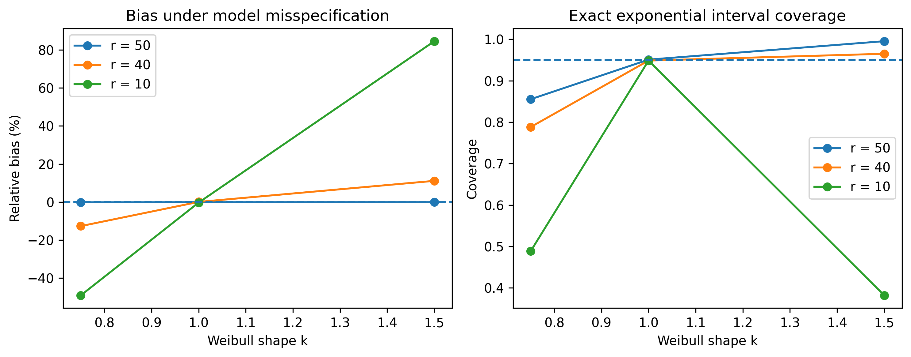

# Statistical Inference under Type-II Censoring

Statistical inference for exponential lifetime data observed under Type-II
censoring, with exact and asymptotic confidence intervals, Monte Carlo
simulation, and a model-misspecification study.

## Problem

Suppose \(n\) components are tested simultaneously and the experiment stops
after the \(r\)-th failure. The first \(r\) failure times are observed exactly,
while the remaining \(n-r\) units are known only to have survived beyond the
stopping time.

The goal is to estimate the exponential mean lifetime while properly using the
information contributed by censored observations.

## Methods

The project includes:

- Maximum likelihood estimation under Type-II censoring
- Exact confidence intervals based on a chi-square pivotal quantity
- Wald and log-Wald confidence intervals
- Monte Carlo evaluation with 10,000 replications
- Comparison with a naive estimator that ignores censoring
- Empirical coverage, interval length, and Monte Carlo error
- Weibull misspecification analysis

## Main Results

For \(n=50\), \(r=10\), and a true mean lifetime of 5000 hours:

- Exact 95% interval coverage: **94.87%**
- Wald 95% interval coverage: **90.13%**
- Ignoring censored observations underestimated the mean lifetime by about **88.3%**

Under Weibull misspecification, severe censoring substantially amplified both
estimation bias and coverage error.

## Figures

### Severe censoring



### Model misspecification



## Project Structure

```text
.
├── docs/
│   ├── final_report.pdf
│   └── original_assignment.pdf
├── results/
│   ├── figures/
│   ├── simulation_results.csv
│   └── weibull_sensitivity.csv
├── src/
│   ├── __init__.py
│   └── inference.py
├── tests/
│   └── test_inference.py
├── simulate.py
├── requirements.txt
└── README.md